# 📚 Book Store – Full Stack E-Commerce Web Application

<p align="center">
  
</p>

<p align="center">
  A complete full-stack online bookstore platform with user shopping, secure payments, order tracking, inventory management, company management, transporter management, and an admin dashboard.
</p>

<p align="center">
  
  
  
  
  
</p>

---

## 🌐 Live Application

**Frontend:**
`https://book-store-frontend-2pz4.onrender.com`

**Backend API:**
`https://book-store-backend-0klb.onrender.com`

---

# 📖 About The Project

The **Book Store** is a full-stack e-commerce application designed to provide a complete online book purchasing experience.

Users can browse books, search and filter products, view detailed book information, read reviews, add books to their cart or wishlist, apply coupons, manage delivery addresses, make secure online payments, and track their orders.

The application also provides separate management systems for:

* 👤 Customers
* 👨‍💼 Administrators
* 🏢 Companies
* 🚚 Transporters

The admin can manage the complete book-selling workflow, from adding books and maintaining inventory to assigning transporters and updating order statuses.

---

# 🎯 Project Objective

The main objective of this project is to build a scalable and secure **full-stack e-commerce platform** for selling books online.

The system handles the complete order lifecycle:

```text
Book Added
    ↓
Inventory Managed
    ↓
Customer Places Order
    ↓
Payment Completed
    ↓
Order Confirmed
    ↓
Order Packed
    ↓
Order Shipped
    ↓
Assigned to Transporter
    ↓
Out For Delivery
    ↓
Delivered
```

---

# 👥 User Roles

The application contains four major roles.

| Role           | Responsibilities                                                     |
| -------------- | -------------------------------------------------------------------- |
| 👤 User        | Browse books, cart, wishlist, checkout, payment, reviews, tracking   |
| 👨‍💼 Admin       | Manage books, inventory, orders, companies, transporters and coupons |
| 🏢 Company     | Manage company-related order operations                              |
| 🚚 Transporter | Manage assigned deliveries and update delivery status                |

---

# 👤 User Features

## 🔐 Authentication

Users can securely register and log in using JWT-based authentication.

Features include:

* User registration
* User login
* JWT authentication
* Protected routes
* Role-based access
* Secure API requests

---

## 🏠 Home Page

The homepage provides users with quick access to:

* Featured books
* Recommended books
* Newly added books
* Book categories
* Search
* Navigation to book details

### Screenshot

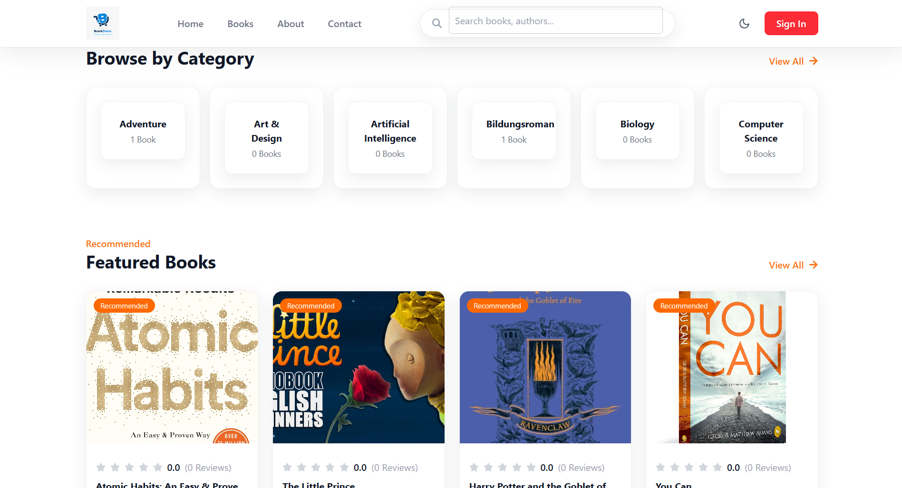

---

# 📚 Book Management

Users can browse available books and view:

* Book title
* Author
* Category
* Price
* Previous price
* Cover image
* Ratings
* Number of reviews
* Available quantity

Users can also search and filter books according to their requirements.

### Screenshot

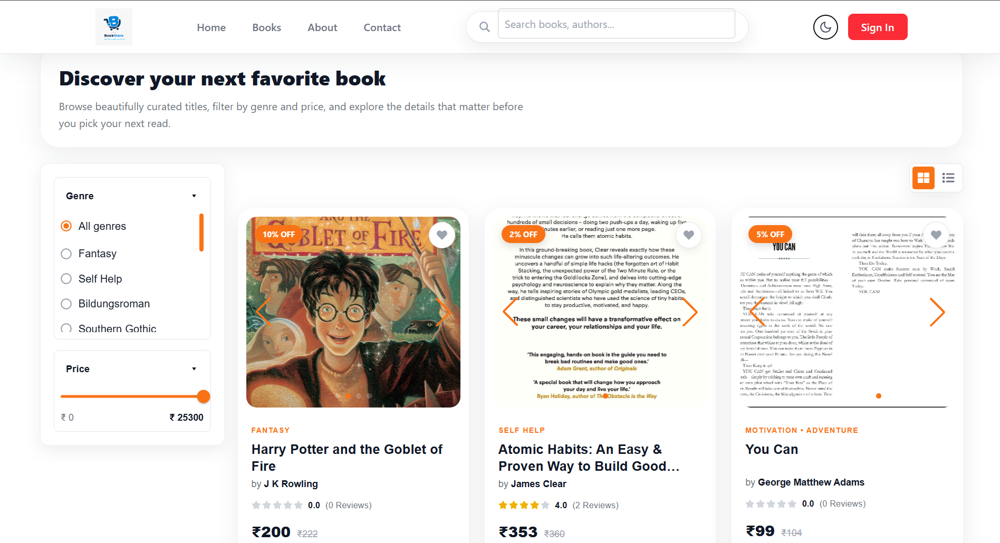

---

# 📖 Book Details

The book details page displays complete information about a selected book.

Features include:

* Book information
* Author
* Category
* Price
* Ratings
* Customer reviews
* Available quantity
* Add to cart
* Add to wishlist

### Screenshot


---

# ⭐ Reviews & Ratings

Users can submit reviews and ratings for books.

The system dynamically calculates:

* Average rating
* Total review count

Example:

```text
Rating: 4.5 ⭐
Reviews: 125
```

---

# ❤️ Wishlist

Users can add books to their wishlist for later purchase.

Wishlist functionality allows users to:

* Add books
* Remove books
* View saved books
* Move back to shopping

### Screenshot

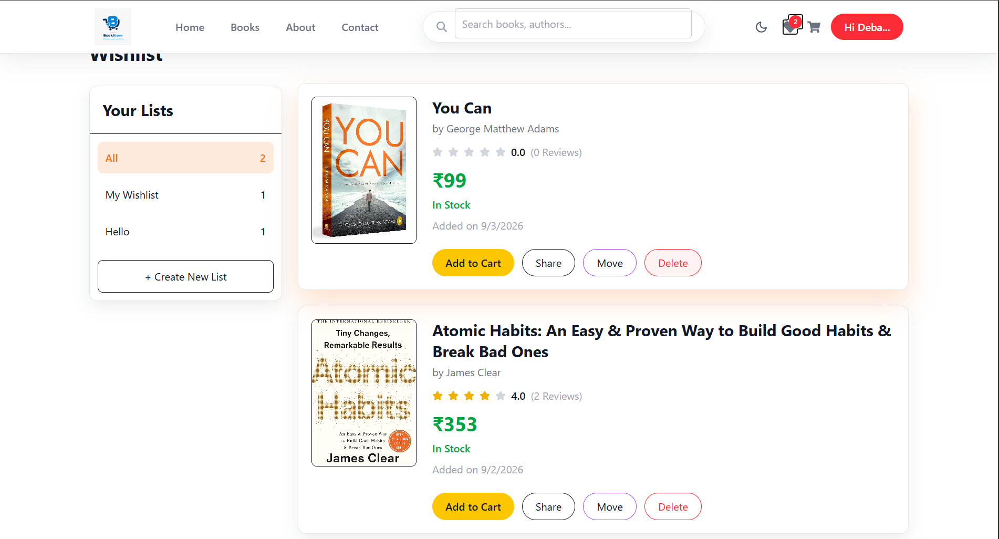

---

# 🛒 Shopping Cart

Users can manage their selected books through the shopping cart.

Features:

* Add books
* Remove books
* Increase quantity
* Decrease quantity
* View subtotal
* Apply coupon
* Calculate total amount

### Screenshot

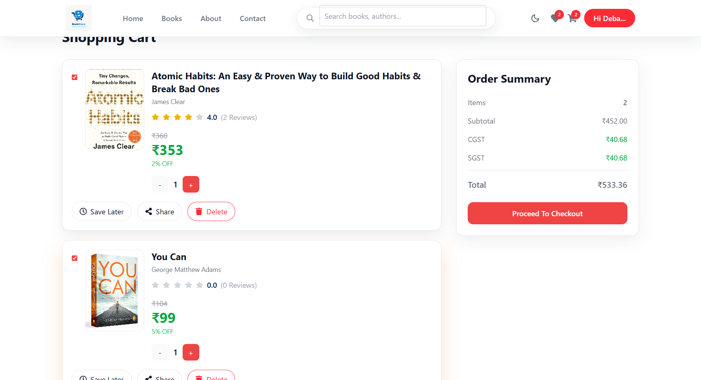

---

# 🎟️ Coupon System

The application supports coupon-based discounts.

Users can:

* View available coupons
* Apply coupons
* Remove coupons
* Automatically calculate discounted totals
  
### Screenshot
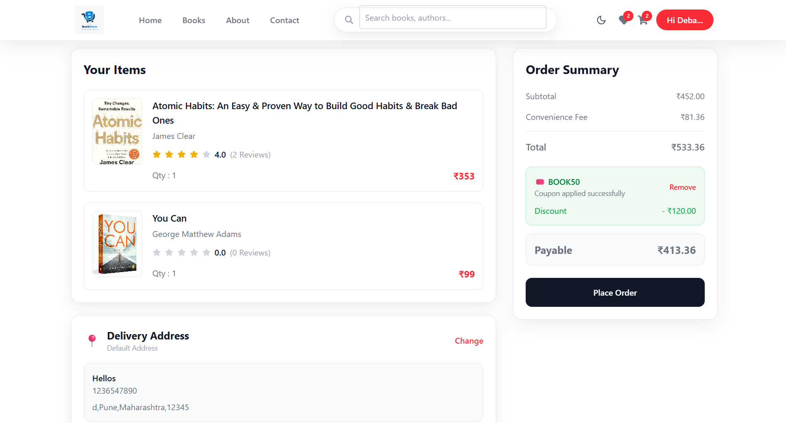
---

# 📍 Address Management

Users can manage multiple delivery addresses.

Features include:

* Add address
* Edit address
* Delete address
* Set default address
* Select delivery address during checkout

### Screenshot
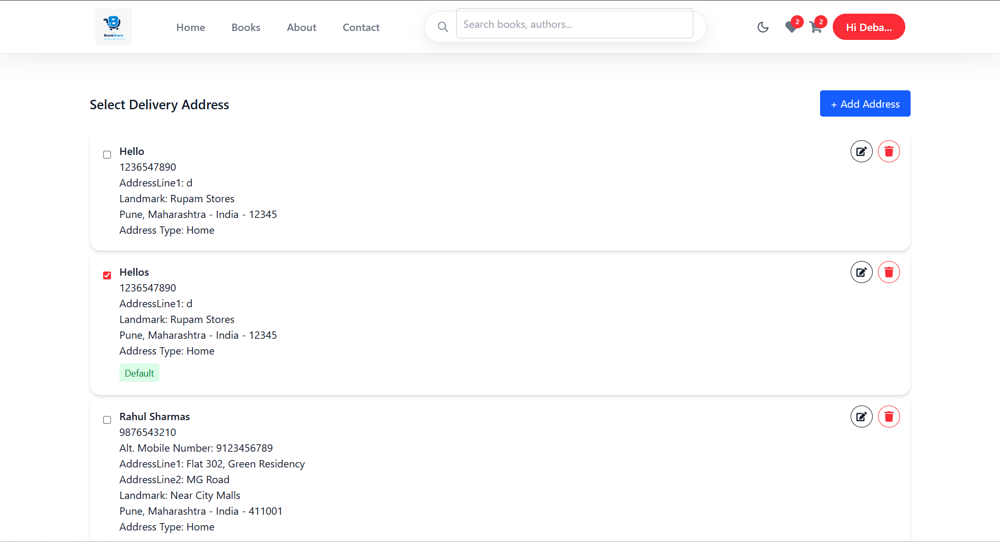
---

# 💳 Secure Payment

The application integrates **Razorpay** for online payment processing.

Payment workflow:

```text
Checkout
   ↓
Create Razorpay Order
   ↓
Open Payment Gateway
   ↓
Customer Completes Payment
   ↓
Payment Verification
   ↓
Order Confirmation
```

---

# 📦 Order Management

Users can view their complete order history.

Order information includes:

* Order number
* Books purchased
* Quantity
* Price
* Payment method
* Payment status
* Order status
* Delivery information
* Invoice

### Screenshot

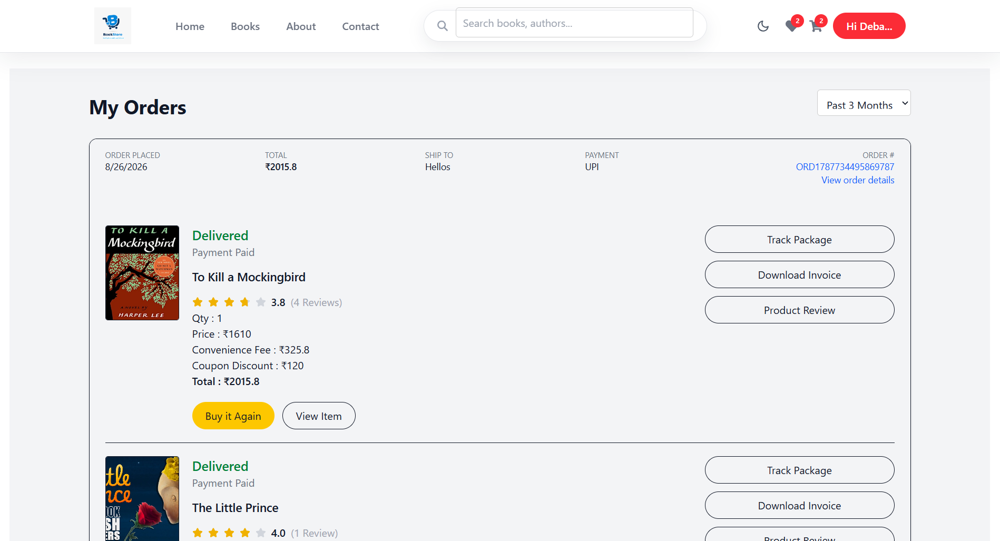

---

# 🚚 Order Tracking

Customers can track their orders through different delivery stages.

```text
Ordered
   ↓
Confirmed
   ↓
Packed
   ↓
Shipped
   ↓
Out For Delivery
   ↓
Delivered
```

The tracking system records important delivery dates such as:

* Packaging date
* Shipping date
* Out-for-delivery date
* Delivered date
* Estimated delivery date

### Screenshot

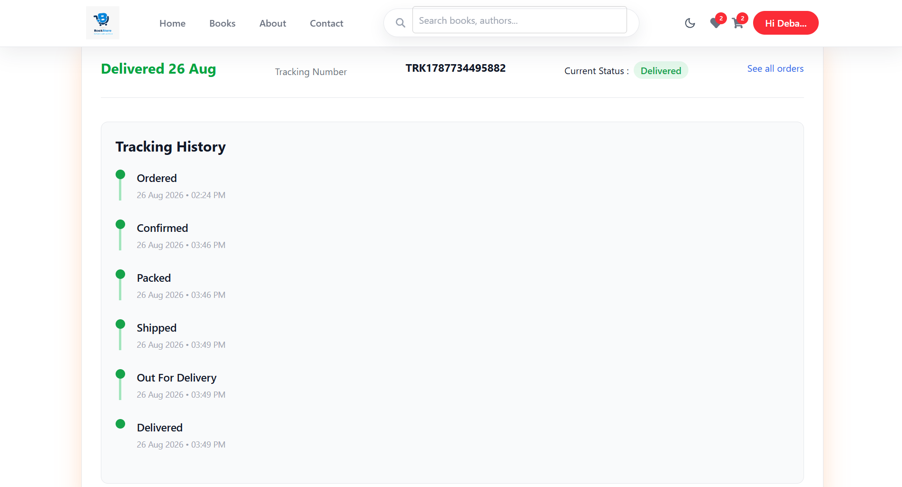

---

# 🧾 Invoice Generation

After successful order processing, the system can generate an invoice containing:

* Customer details
* Order details
* Purchased books
* Quantity
* Price
* Taxes
* Total amount
* Payment information

Invoices can be downloaded by users.

---

# 📧 Email Notifications

**Brevo** is integrated for transactional email communication.

Emails can be sent for:

* Order confirmation
* Order status updates
* Shipping updates
* Out-for-delivery notification
* Delivery confirmation
* Invoice

Example workflow:

```text
Order Confirmed
      ↓
Email Sent
      ↓
Order Packed
      ↓
Email Sent
      ↓
Order Shipped
      ↓
Email Sent
      ↓
Delivered
      ↓
Email Sent
```

---

# 👨‍💼 Admin Dashboard

The admin dashboard provides centralized control over the entire application.

### Admin can manage:

* Books
* Book quantities
* Orders
* Customers
* Companies
* Transporters
* Coupons
* Order statuses
* Delivery assignments

### Screenshot

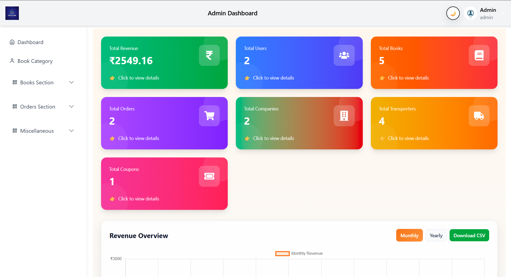

---

# 📊 Admin Dashboard Statistics

The dashboard displays important business statistics such as:

* Total Orders
* Pending Orders
* Confirmed Orders
* Packed Orders
* Shipped Orders
* Out For Delivery Orders
* Delivered Orders
* Cancelled Orders
* Recent Orders

---

# 📚 Admin Book Management

Administrators can:

* Add books
* Edit books
* Delete books
* Activate/deactivate books
* Mark books as recommended
* Manage book categories
* Upload book cover images

### Screenshot

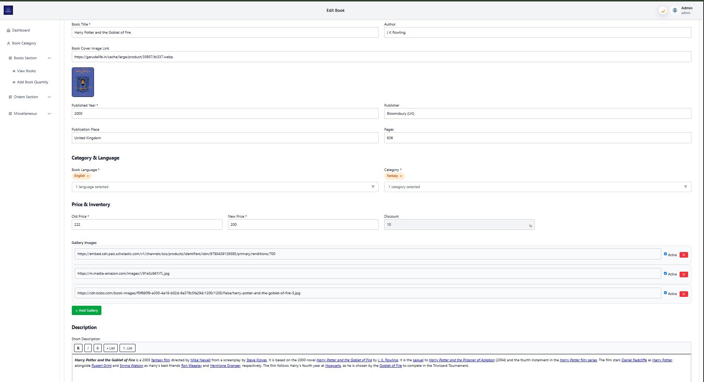

---

# 📦 Inventory Management

The inventory system manages book quantities.

Administrators can monitor:

* Available quantity
* Active inventory
* Book stock
* Quantity updates

The system calculates available inventory using the book quantity records.

---

# 🏢 Company Management

The application contains a dedicated **Company Management** module.

Companies can be registered and managed by administrators.

### Company Features

* Company registration
* Company login
* Company profile
* Company email
* Company order management
* Company-related order tracking
* Company-specific dashboard
* Company order statistics

### Company Dashboard

The company dashboard provides information about orders associated with that company.

Statistics include:

```text
Total Orders
Pending Orders
Confirmed Orders
Packed Orders
Shipped Orders
Out For Delivery
Delivered Orders
Cancelled Orders
```

### Company Order Flow

```text
Company
   ↓
Receives Order
   ↓
Confirms Order
   ↓
Packs Order
   ↓
Ships Order
   ↓
Transporter Assigned
   ↓
Out For Delivery
   ↓
Delivered
```

### Company Responsibilities

Companies can participate in the order fulfillment process by managing orders associated with their organization.

The system uses company-specific identification to ensure that companies only access relevant order information.

### Screenshot

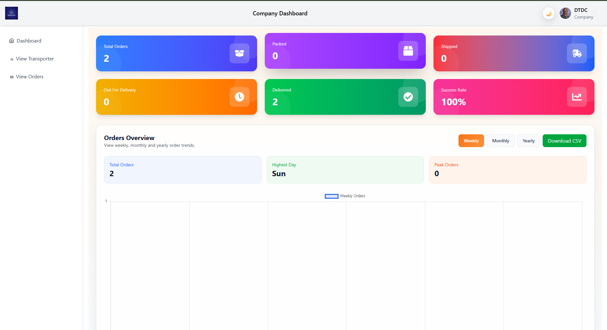

---

# 🚚 Transporter Management

The admin can create and manage transporters.

Transporter information includes:

* Name
* Company
* Email
* Mobile number
* Vehicle number
* Vehicle type
* Active/inactive status
* Availability

Supported vehicle types include:

```text
Bike
Scooter
Car
Van
Truck
```

---

# 🚚 Transporter Dashboard

Transporters have their own dashboard.

Features include:

* Transporter login
* View assigned deliveries
* View today's deliveries
* View order details
* Update delivery status
* Track assigned orders

### Screenshot

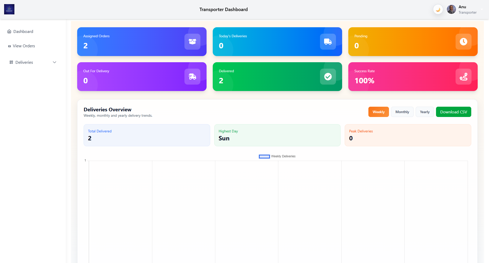

---

# 🔄 Delivery Workflow

The transporter can update the order through the delivery lifecycle.

```text
Ordered
   ↓
Confirmed
   ↓
Packed
   ↓
Shipped
   ↓
Out For Delivery
   ↓
Delivered
```

When the order is delivered, the system records the delivery date and updates the customer tracking information.

---

# 🔒 Security

The backend uses **JWT-based authentication** to protect APIs.

Security features include:

* JWT authentication
* Protected routes
* Role-based authorization
* Password authentication
* Authenticated API requests
* CORS configuration

Different users have access to different sections of the application.

```text
User
 └── User APIs

Admin
 └── Admin APIs

Company
 └── Company APIs

Transporter
 └── Transporter APIs
```

---

# 🏗️ Project Architecture

```text
                    ┌─────────────────────┐
                    │      React.js       │
                    │     Frontend        │
                    └──────────┬──────────┘
                               │
                               │ REST API
                               ↓
                    ┌─────────────────────┐
                    │    Node.js +        │
                    │    Express.js       │
                    └──────────┬──────────┘
                               │
              ┌────────────────┼────────────────┐
              │                │                │
              ↓                ↓                ↓
        ┌──────────┐    ┌────────────┐   ┌────────────┐
        │ MongoDB  │    │  Razorpay  │   │   Brevo    │
        │ Database │    │  Payments  │   │   Emails   │
        └──────────┘    └────────────┘   └────────────┘
```

You can replace the diagram above with your actual architecture image:

```markdown

```

---

# 🛠️ Tech Stack

## Frontend

* React.js
* Tailwind CSS
* Material UI
* Axios
* React Router
* React Toastify
* Framer Motion
* Swiper

## Backend

* Node.js
* Express.js
* MongoDB
* Mongoose
* JWT
* REST APIs

## Integrations

* Razorpay – Payment Gateway
* Brevo – Transactional Email
* AWS – Cloud/Deployment Services

---

# 📁 Project Structure

```text
Book-Store/
│
├── frontend/
│   │
│   ├── public/
│   │
│   ├── src/
│   │   ├── components/
│   │   ├── context/
│   │   ├── pages/
│   │   ├── services/
│   │   ├── assets/
│   │   └── App.jsx
│   │
│   └── package.json
│
├── backend/
│   │
│   ├── models/
│   ├── routes/
│   ├── middleware/
│   ├── services/
│   ├── uploads/
│   ├── templates/
│   ├── db.js
│   ├── server.js
│   └── package.json
│
├── screenshots/
│   ├── book-store-banner.png
│   ├── architecture.png
│   ├── home.png
│   ├── books.png
│   ├── book-details.png
│   ├── wishlist.png
│   ├── cart.png
│   ├── checkout.png
│   ├── orders.png
│   ├── order-tracking.png
│   ├── admin-dashboard.png
│   ├── admin-books.png
│   └── transporter-dashboard.png
│
└── README.md
```

---

# 🚀 Installation

## 1. Clone Repository

```bash
git clone https://github.com/Debadrita-rgb/book-store.git

cd book-store
```

---

# ⚙️ Backend Setup

```bash
cd backend

npm install
```

Create a `.env` file:

```env
PORT=5000

MONGO_URL=your_mongodb_connection_string

JWT_SECRET=your_secret_key

RAZORPAY_KEY_ID=your_razorpay_key

RAZORPAY_KEY_SECRET=your_razorpay_secret

BREVO_API_KEY=your_brevo_api_key
```

Start the backend:

```bash
npm start
```

Backend:

```text
http://localhost:5000
```

---

# 💻 Frontend Setup

Open another terminal:

```bash
cd frontend

npm install
```

Start the development server:

```bash
npm run dev
```

Frontend:

```text
http://localhost:5173
```

---

# 🔌 API Highlights

| Method | Endpoint                         | Description              |
| ------ | -------------------------------- | ------------------------ |
| POST   | `/user/signup`                   | User Registration        |
| POST   | `/user/signin`                   | User Login               |
| GET    | `/user/home-recommended-books`   | Latest Recommended Books |
| POST   | `/user/confirm-book-order`       | Place Book Order         |
| GET    | `/user/track-package/:id`        | Track Order              |
| PUT    | `/admin/update-order-status/:id` | Update Order Status      |
| GET    | `/transporter/todays-deliveries` | Get Today's Deliveries   |
| POST   | `/admin/add-transporter`         | Add Transporter          |
| GET    | `/admin/get-all-transporters`    | Get Transporters         |

# 🧩 Key Modules

```text
Authentication
       │
       ├── User Authentication
       ├── Admin Authentication
       ├── Company Authentication
       └── Transporter Authentication
       
Book Management
       │
       ├── Books
       ├── Categories
       ├── Reviews
       └── Inventory

Shopping
       │
       ├── Cart
       ├── Wishlist
       ├── Coupons
       └── Checkout

Orders
       │
       ├── Order Creation
       ├── Payment
       ├── Invoice
       └── Tracking

Delivery
       │
       ├── Company
       ├── Transporter
       └── Delivery Tracking
```

---

# 📈 Complete Order Lifecycle

```text
                    CUSTOMER
                       │
                       ↓
                  Place Order
                       │
                       ↓
                    Payment
                       │
                       ↓
                  ┌─────────┐
                  │ Ordered │
                  └────┬────┘
                       ↓
                  ┌──────────┐
                  │Confirmed │
                  └────┬─────┘
                       ↓
                  ┌────────┐
                  │ Packed │
                  └────┬───┘
                       ↓
                  ┌─────────┐
                  │ Shipped │
                  └────┬────┘
                       ↓
              Transporter Assigned
                       │
                       ↓
              ┌────────────────┐
              │ Out For Delivery│
              └───────┬────────┘
                      ↓
                ┌───────────┐
                │ Delivered │
                └───────────┘
```

---

# 🌟 Highlights

### ✅ Full-Stack Architecture

Complete frontend and backend implementation using React.js, Node.js, Express.js and MongoDB.

### ✅ Role-Based System

Separate functionality for:

* Customers
* Administrators
* Companies
* Transporters

### ✅ Secure Payments

Razorpay integration for online payments.

### ✅ Automated Emails

Transactional emails through Brevo.

### ✅ Inventory Management

Real-time available quantity calculation.

### ✅ Order Tracking

Complete order and delivery lifecycle tracking.

### ✅ Invoice Generation

Automatically generated order invoices.

---

# 🔮 Future Improvements

* AI-powered book recommendations
* Advanced search
* Multi-language support
* Real-time delivery tracking
* Push notifications
* Seller dashboard
* Advanced analytics
* Mobile application
* Redis caching
* Elasticsearch-based book search

---

# 👨‍💻 Author

## Debadrita Paul

**Full Stack Web Developer**

### Technologies

```text
React.js
Node.js
Express.js
MongoDB
Brevo
REST API
JWT
Razorpay
```

---

# 📄 License

This project is developed for educational, portfolio, and demonstration purposes.

---

# ⭐ Support

If you find this project useful, consider giving the repository a ⭐ on GitHub.
